# vBRIEF v0.5 User Guide

**Version**: 0.5  
**Last Updated**: 2026-02-03

## Introduction

vBRIEF (Basic Relational Intent Exchange Format) is an open, standardized format for agentic memory systems that provides:

- **Unified Model**: Single Plan container for todos, plans, playbooks, and prompt-graphs
- **Graduated Complexity**: Start simple, add features as needed
- **Token Efficiency**: TRON encoding reduces LLM token usage by 35-40%
- **DAG Support**: Directed acyclic graphs for complex workflows
- **Interoperability**: JSON Schema validation and cross-platform compatibility

## Quick Start

### Minimal Plan (Todo-like)

```json
{
  "vBRIEFInfo": {"version": "0.5"},
  "plan": {
    "title": "Daily Tasks",
    "status": "running",
    "items": [
      {"title": "Fix authentication bug", "status": "pending"},
      {"title": "Review PR #123", "status": "running"}
    ]
  }
}
```

**That's it!** A minimal Plan requires only:
- `vBRIEFInfo.version`: `"0.5"`
- `plan.title`: Any descriptive name
- `plan.status`: Current status (draft, running, completed, etc.)
- `plan.items`: Array of items (can be empty)

## Core Concepts

### The Unified Plan Model

vBRIEF v0.5 uses a single `Plan` container that adapts to your needs through graduated complexity:

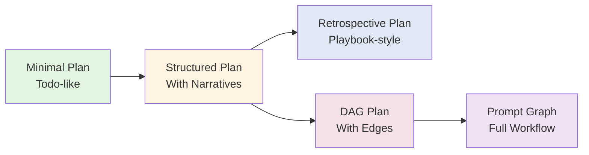

### Plan Structure

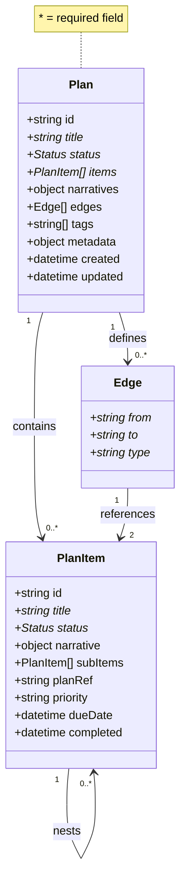

### Status Lifecycle

Plans and items share a common status enum:

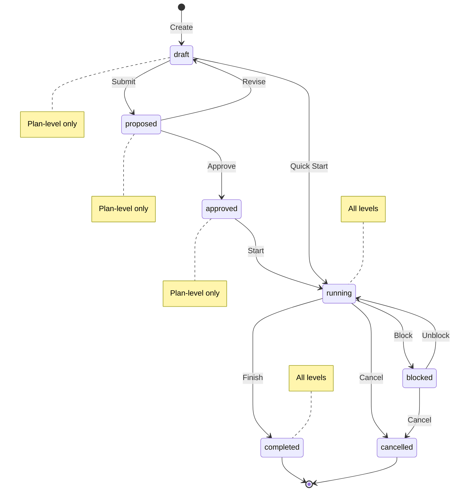

**Status Values:**
- `draft`, `proposed`, `approved` - Plan lifecycle (not for items)
- `pending`, `running`, `completed`, `blocked`, `cancelled` - Execution states (all levels)

## Use Cases

### 1. Simple Task List

Perfect for daily todos, quick task tracking:

```json
{
  "vBRIEFInfo": {"version": "0.5"},
  "plan": {
    "title": "Sprint Tasks",
    "status": "running",
    "items": [
      {
        "title": "Implement login endpoint",
        "status": "completed",
        "priority": "high"
      },
      {
        "title": "Write unit tests",
        "status": "running",
        "priority": "high"
      },
      {
        "title": "Update documentation",
        "status": "pending",
        "priority": "medium",
        "dueDate": "2026-02-10T00:00:00Z"
      }
    ],
    "tags": ["sprint-1", "backend"]
  }
}
```

**Features used:** Basic items, priority, dueDate, tags

### 2. Structured Planning

For project planning with context and rationale:

```json
{
  "vBRIEFInfo": {"version": "0.5"},
  "plan": {
    "id": "api-migration",
    "title": "API Migration to GraphQL",
    "status": "proposed",
    "narratives": {
      "Proposal": "Migrate REST API to GraphQL for better DX",
      "Background": "50+ REST endpoints, inconsistent patterns",
      "Problem": "Overfetching, multiple round-trips, maintenance burden",
      "Constraint": "Must maintain backward compatibility during migration",
      "Alternative": "REST with JSON:API, but lacks type safety",
      "Risk": "Team learning curve, N+1 query optimization"
    },
    "items": [
      {"id": "research", "title": "Research & POC", "status": "completed"},
      {"id": "schema", "title": "Define GraphQL Schema", "status": "running"},
      {"id": "resolvers", "title": "Implement Resolvers", "status": "pending"}
    ],
    "tags": ["architecture", "api", "q1-2026"]
  }
}
```

**Features used:** Narratives, hierarchical IDs, tags

### 3. Incident Retrospective (Playbook)

For capturing lessons learned:

```json
{
  "vBRIEFInfo": {"version": "0.5"},
  "plan": {
    "id": "incident-2026-02-02",
    "title": "Database Outage Postmortem",
    "status": "completed",
    "narratives": {
      "Outcome": "Service restored in 45 minutes, no data loss. 15% users affected.",
      "Strengths": "Clear runbook enabled fast diagnosis. Team communication excellent. Failover worked.",
      "Weaknesses": "Monitoring missed disk space issue. Manual failover took 20 min. No automated alerts.",
      "Lessons": "1. Automate failover. 2. Add canary queries. 3. Disk alerts at 70%. 4. Update runbook."
    },
    "items": [
      {
        "id": "detect",
        "title": "Issue Detected",
        "status": "completed",
        "completed": "2026-02-02T14:05:00Z",
        "narrative": {"Action": "Production alert: API timeouts"}
      },
      {
        "id": "diagnose",
        "title": "Root Cause Found",
        "status": "completed",
        "completed": "2026-02-02T14:15:00Z",
        "narrative": {"Finding": "DB disk at 100%, writes failing"}
      },
      {
        "id": "mitigate",
        "title": "Immediate Mitigation",
        "status": "completed",
        "completed": "2026-02-02T14:30:00Z",
        "narrative": {"Action": "Cleared logs, freed 20GB"}
      },
      {
        "id": "resolve",
        "title": "Full Resolution",
        "status": "completed",
        "completed": "2026-02-02T14:50:00Z",
        "narrative": {"Action": "Scaled volume, verified health"}
      }
    ],
    "tags": ["incident", "database", "postmortem"],
    "created": "2026-02-02T14:00:00Z",
    "updated": "2026-02-03T10:00:00Z"
  }
}
```

**Features used:** Retrospective narratives, completed timestamps, item-level narratives

### 4. DAG Workflow

For pipelines with dependencies:

```json
{
  "vBRIEFInfo": {"version": "0.5"},
  "plan": {
    "id": "ci-pipeline",
    "title": "Continuous Integration Pipeline",
    "status": "running",
    "items": [
      {"id": "lint", "title": "Lint Code", "status": "completed"},
      {"id": "test", "title": "Run Tests", "status": "running"},
      {"id": "build", "title": "Build Artifacts", "status": "pending"},
      {"id": "deploy-stage", "title": "Deploy to Staging", "status": "pending"},
      {"id": "integration", "title": "Integration Tests", "status": "pending"},
      {"id": "deploy-prod", "title": "Deploy to Production", "status": "pending"}
    ],
    "edges": [
      {"from": "lint", "to": "build", "type": "blocks"},
      {"from": "test", "to": "build", "type": "blocks"},
      {"from": "build", "to": "deploy-stage", "type": "blocks"},
      {"from": "deploy-stage", "to": "integration", "type": "blocks"},
      {"from": "integration", "to": "deploy-prod", "type": "blocks"},
      {"from": "lint", "to": "test", "type": "informs"}
    ]
  }
}
```

**Visualization:**

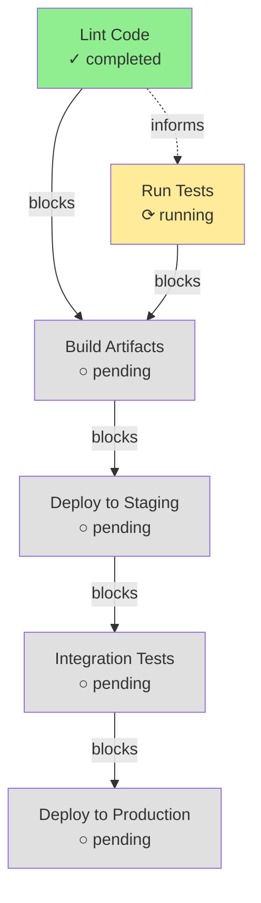

**Features used:** Edges with typed relationships, hierarchical execution

## DAG (Directed Acyclic Graph) Support

### Edge Types

vBRIEF defines four core edge types:

| Type | Meaning | Use Case |
|------|---------|----------|
| `blocks` | Target cannot start until source completes | Pipeline stages, hard dependencies |
| `informs` | Target benefits from source but not blocked | Soft dependencies, context sharing |
| `invalidates` | Source completion makes target unnecessary | Conditional branches, optimization |
| `suggests` | Weak recommendation | Optional enhancements |

**Custom types allowed** - e.g., `triggers`, `produces`, `requires`, etc.

### Edge Semantics

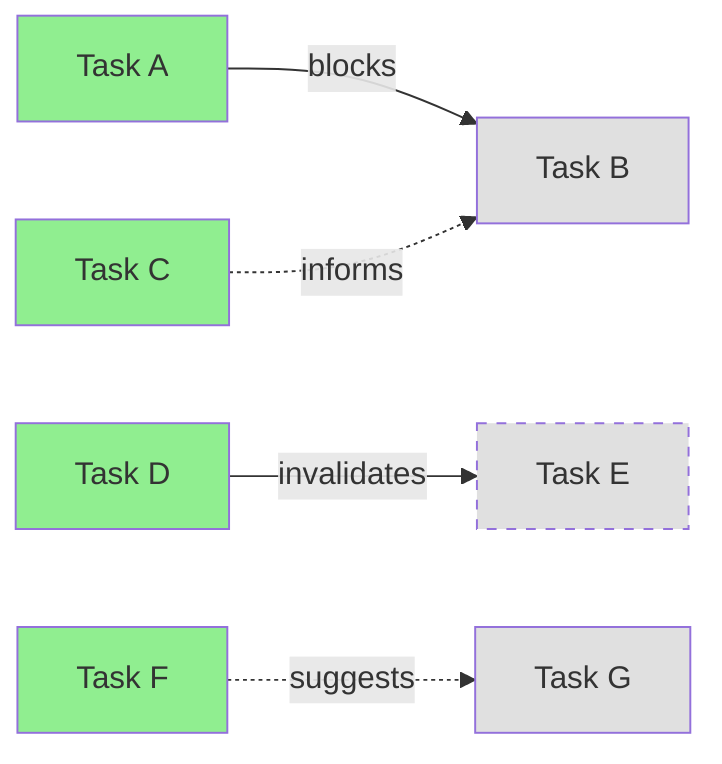

**`blocks`** (solid arrow): B cannot start until A completes  
**`informs`** (dotted): C provides context to B, but B can start anytime  
**`invalidates`** (dashed): If D completes, E is no longer needed  
**`suggests`** (dotted): F recommends G, but G is optional

### Hierarchical IDs

Items can be nested with dot notation:

```json
{
  "items": [
    {
      "id": "backend",
      "title": "Backend Development",
      "status": "running",
      "subItems": [
        {"id": "backend.auth", "title": "Authentication", "status": "completed"},
        {"id": "backend.api", "title": "API Endpoints", "status": "running"}
      ]
    }
  ],
  "edges": [
    {"from": "backend.auth", "to": "backend.api", "type": "blocks"}
  ]
}
```

**Visualization:**

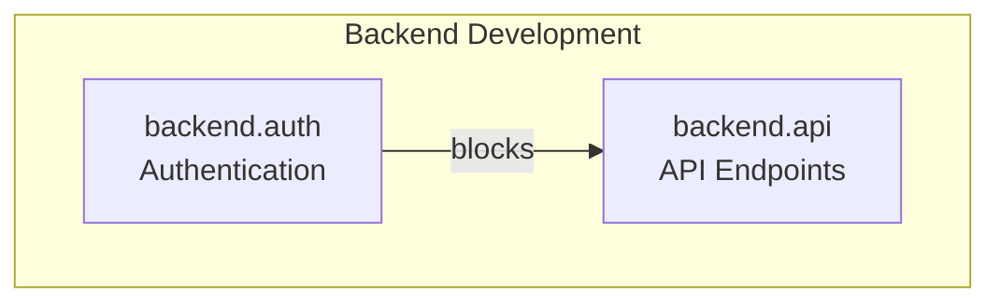

### DAG Validation

Plans MUST form a valid DAG (no cycles):

**❌ Invalid (cycle):**
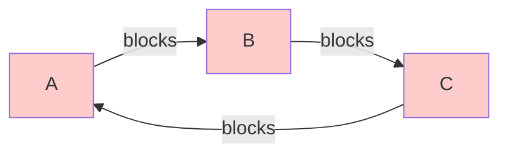

**✅ Valid (acyclic):**
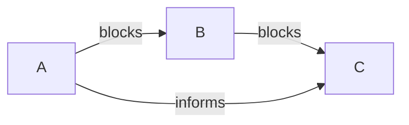

Use the validator to check:
```bash
python3 validation/vbrief_validator.py plan.vbrief.json
```

## Narratives

Narratives provide context, rationale, and reflection.

### Planning Narratives (TitleCase)

For design documents and project plans:

- `Proposal` - What you're proposing
- `Overview` - High-level summary
- `Background` - Context and history
- `Problem` - What problem this solves
- `Constraint` - Limitations and boundaries
- `Hypothesis` - Assumptions being tested
- `Alternative` - Other options considered
- `Risk` - Potential issues
- `Test` - How to validate
- `Action` - What to do
- `Observation` - What was observed
- `Result` - Outcome of action
- `Reflection` - Lessons and insights

### Retrospective Narratives

For postmortems and playbooks:

- `Outcome` - What happened (results)
- `Strengths` - What went well
- `Weaknesses` - What didn't go well
- `Lessons` - What to do differently

### Custom Narratives

Add your own keys following TitleCase convention:

```json
{
  "narratives": {
    "ExecutiveSummary": "...",
    "TechnicalApproach": "...",
    "SecurityConsiderations": "...",
    "PerformanceMetrics": "..."
  }
}
```

## External References

### planRef - Linking Plans

Items can reference external Plan documents:

```json
{
  "items": [
    {
      "id": "backend",
      "title": "Backend Development",
      "status": "running",
      "planRef": "file://./backend-plan.vbrief.json"
    },
    {
      "id": "frontend",
      "title": "Frontend Development",
      "status": "pending",
      "planRef": "#frontend-impl"
    }
  ]
}
```

**URI syntax:**
- `#item-id` - Internal reference (within same Plan)
- `file://./path/to/plan.vbrief.json` - Local file
- `file://./plan.vbrief.json#item-5` - Specific item in local file
- `https://example.com/plans/sprint.vbrief.json` - Remote URL

### Modular Plans

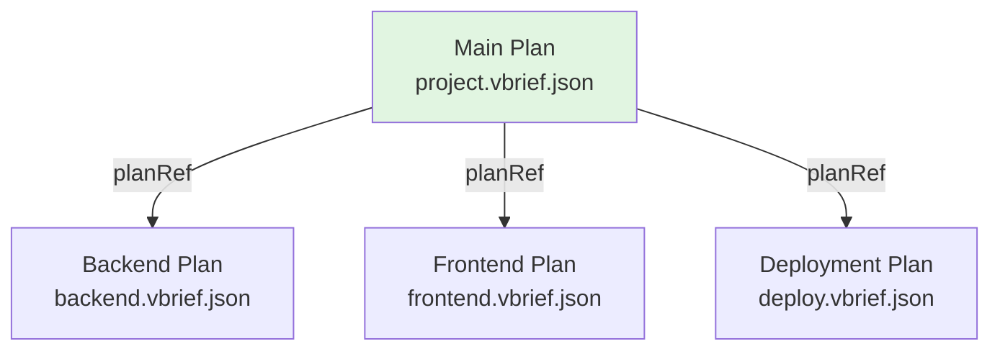

## TRON Format

For token efficiency in AI workflows, use TRON:

**JSON** (267 tokens):
```json
{
  "vBRIEFInfo": {"version": "0.5"},
  "plan": {
    "title": "Build Pipeline",
    "status": "running",
    "items": [
      {"id": "lint", "title": "Lint", "status": "completed"},
      {"id": "test", "title": "Test", "status": "running"},
      {"id": "build", "title": "Build", "status": "pending"}
    ],
    "edges": [
      {"from": "lint", "to": "build", "type": "blocks"},
      {"from": "test", "to": "build", "type": "blocks"}
    ]
  }
}
```

**TRON** (162 tokens, **39% savings**):
```tron
class Edge: from, to, type
class PlanItem: id, title, status

vBRIEFInfo: {version: "0.5"}
plan: {
  title: "Build Pipeline",
  status: "running",
  items: [
    PlanItem("lint", "Lint", "completed"),
    PlanItem("test", "Test", "running"),
    PlanItem("build", "Build", "pending")
  ],
  edges: [
    Edge("lint", "build", "blocks"),
    Edge("test", "build", "blocks")
  ]
}
```

See [TRON Encoding Guide](docs/tron-encoding.md) for details.

## Best Practices

### 1. Start Simple, Add Complexity

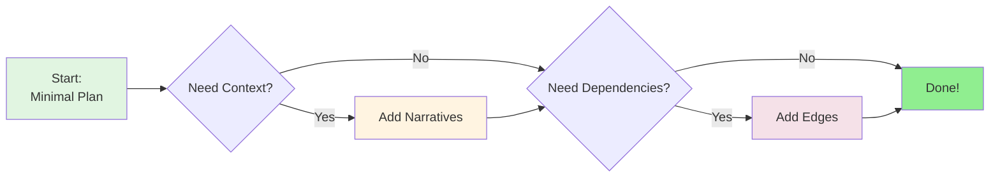

### 2. Use Hierarchical IDs

**Good:**
```json
{"id": "backend.auth.jwt", "title": "JWT Implementation"}
```

**Avoid:**
```json
{"id": "task-17-implementation-jwt", "title": "JWT Implementation"}
```

### 3. Choose Right Edge Type

- **`blocks`** for hard dependencies (must wait)
- **`informs`** for context sharing (nice to have)
- **`invalidates`** for conditional paths (optimization)
- **`suggests`** for recommendations (optional)

### 4. Keep DAGs Shallow

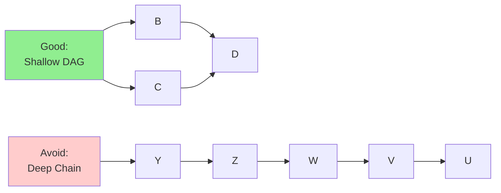

### 5. Document Retrospectives

After completing work, add retrospective narratives:

```json
{
  "status": "completed",
  "narratives": {
    "Outcome": "Deployed in 2 weeks, under budget",
    "Strengths": "Clear requirements, good team communication",
    "Weaknesses": "Testing was rushed, found bugs in production",
    "Lessons": "Allocate 30% time for testing, use staging environment"
  }
}
```

## Validation

Validate your documents:

```bash
# Comprehensive validation
python3 validation/vbrief_validator.py plan.vbrief.json

# DAG validation only
python3 validation/dag_validator.py plan.vbrief.json
```

**Validation checks:**
1. JSON syntax
2. Schema compliance
3. Version = "0.5"
4. Required fields present
5. Status values valid
6. Hierarchical IDs well-formed
7. planRef URIs valid
8. No cycles in edges
9. Edge references resolve
10. Narrative keys TitleCase (warning)

## Common Patterns

### Sprint Planning

```json
{
  "plan": {
    "title": "Sprint 5",
    "status": "running",
    "items": [
      {
        "title": "User Story: Login",
        "status": "running",
        "priority": "high",
        "dueDate": "2026-02-05T00:00:00Z",
        "subItems": [
          {"title": "Backend API", "status": "completed"},
          {"title": "Frontend UI", "status": "running"},
          {"title": "Tests", "status": "pending"}
        ]
      }
    ],
    "tags": ["sprint-5", "auth"]
  }
}
```

### Technical RFC

```json
{
  "plan": {
    "title": "RFC: Microservices Architecture",
    "status": "proposed",
    "narratives": {
      "Proposal": "Split monolith into microservices",
      "Problem": "Monolith is hard to scale and deploy",
      "Alternative": "Modular monolith with clear boundaries",
      "Risk": "Increased operational complexity",
      "Test": "Pilot with user service, measure latency"
    },
    "items": [
      {"title": "Phase 1: Extract User Service", "status": "proposed"},
      {"title": "Phase 2: Extract Product Service", "status": "draft"}
    ]
  }
}
```

### Release Checklist

```json
{
  "plan": {
    "title": "v2.0 Release Checklist",
    "status": "running",
    "items": [
      {"title": "Code freeze", "status": "completed"},
      {"title": "Run regression tests", "status": "completed"},
      {"title": "Update changelog", "status": "running"},
      {"title": "Deploy to staging", "status": "pending"},
      {"title": "Smoke tests on staging", "status": "pending"},
      {"title": "Deploy to production", "status": "pending"},
      {"title": "Monitor metrics", "status": "pending"}
    ],
    "edges": [
      {"from": "code-freeze", "to": "regression", "type": "blocks"},
      {"from": "regression", "to": "deploy-staging", "type": "blocks"},
      {"from": "deploy-staging", "to": "smoke-tests", "type": "blocks"},
      {"from": "smoke-tests", "to": "deploy-prod", "type": "blocks"}
    ]
  }
}
```

## Further Reading

- [Specification](SPECIFICATION.md) - Complete technical specification
- [Migration Guide](MIGRATION.md) - v0.4 → v0.5 migration
- [TRON Encoding](docs/tron-encoding.md) - Token efficiency guide
- [Examples](examples/) - Sample documents
- [JSON Schema](schemas/vbrief-core.schema.json) - Machine-readable schema

## Getting Help

- Validate: `python3 validation/vbrief_validator.py your-file.vbrief.json`
- Issues: https://github.com/visionik/vBRIEF/issues
- Discussions: https://github.com/visionik/vBRIEF/discussions
