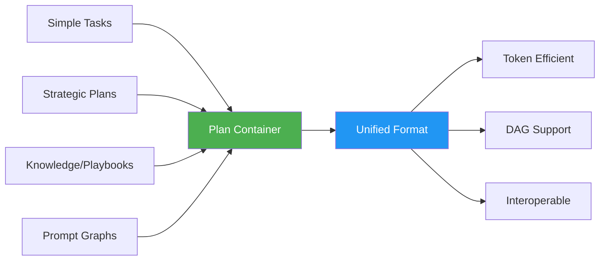
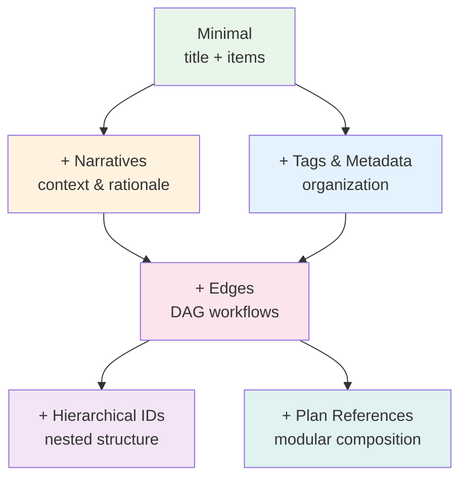
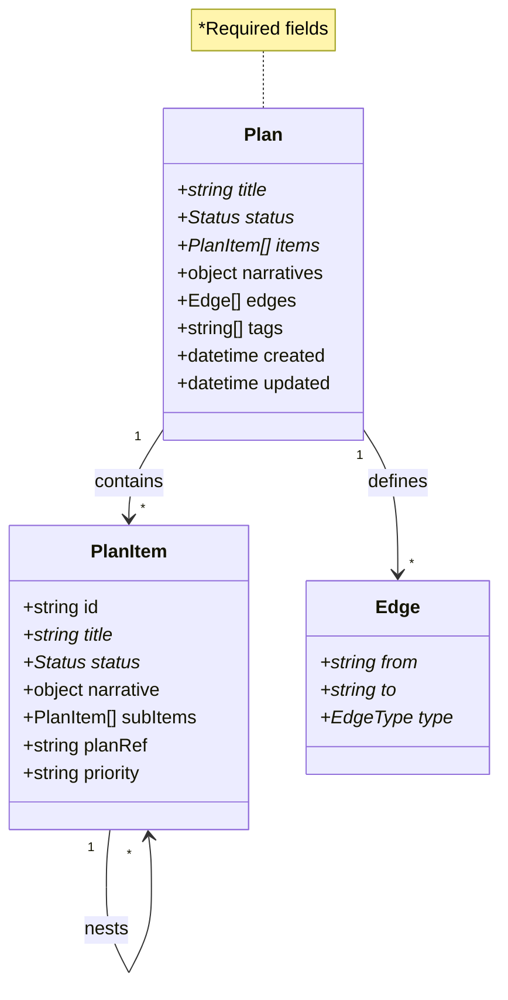
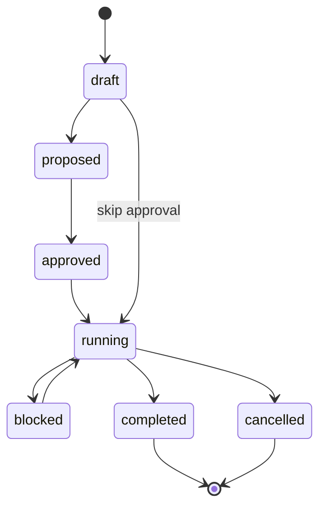
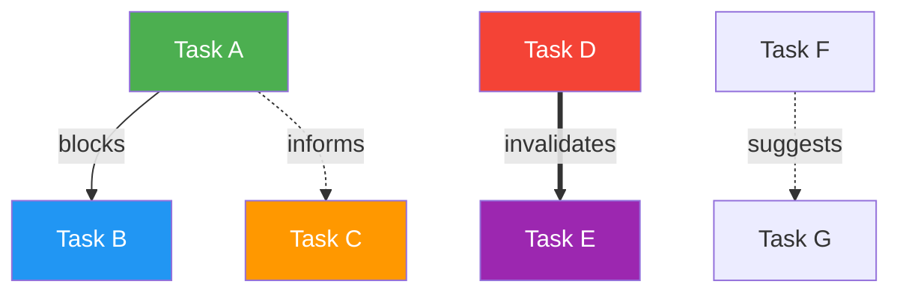
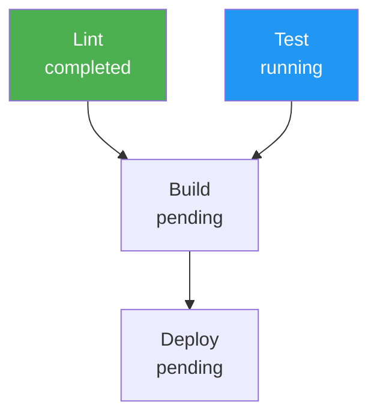

# vBRIEF v0.5-beta

> **BETA RELEASE**: Core architecture is stable but API implementations are pending. Feedback welcome via [GitHub issues](https://github.com/visionik/vBRIEF/issues).

vBRIEF (Basic Relational Intent Exchange Format) is an **open, standardized format** for agentic memory systems that unifies todos, plans, playbooks, and prompt-graphs into a single, powerful `Plan` model.



## Quick Start

**Minimal Plan** (todo-like usage):

```json
{
  "vBRIEFInfo": {"version": "0.5"},
  "plan": {
    "title": "Daily Tasks",
    "status": "running",
    "items": [
      {"title": "Fix auth bug", "status": "pending"},
      {"title": "Review PR #123", "status": "running"}
    ]
  }
}
```

**That's it!** Only 4 required fields: `version`, `title`, `status`, `items`.

## What's New in v0.5

### Major Changes

🎉 **Unified Plan Model** - Single container replaces TodoList/Plan/Playbook  
📊 **DAG Support** - Directed acyclic graphs with 4 edge types  
🔗 **Hierarchical IDs** - Dot notation for nested organization  
⚡ **35-40% Token Savings** - TRON encoding for LLMs  
✅ **Comprehensive Validation** - Schema + conformance + cycle detection  
🛠️ **Developer Tools** - DAG visualizer and validators included  

### Graduated Complexity Model



Start simple, add complexity only when needed.

## Core Concepts

### Plan Structure



### Status Lifecycle



**8 status values:** `draft`, `proposed`, `approved`, `pending`, `running`, `completed`, `blocked`, `cancelled`

### DAG Edge Types



- **blocks** (→): Hard dependency - must complete before
- **informs** (⋯→): Soft dependency - provides useful context
- **invalidates** (⇒): Completion makes target obsolete
- **suggests** (⋯→): Optional follow-up recommendation

## Goals

vBRIEF establishes a universal, open standard for agentic memory systems that:

1. ✅ **Reduces LLM context overhead** via efficient structured formats
2. ✅ **Prevents context collapse** by preserving detail and nuance
3. ✅ **Enables interoperability** across AI agents and tools
4. ✅ **Supports full lifecycle** from tasks → plans → accumulated knowledge
5. ✅ **Prevents vendor lock-in** with open, documented format
6. ✅ **Scales complexity** through modular, graduated design
7. ✅ **Bridges human-AI collaboration** with dual encoding (JSON/TRON)
8. 🔄 **Enables transactional logs** for IP defense (future)
9. 🔄 **Accelerates research adoption** via extensible tools (future)
10. ✅ **Works with non-AI tools** - universal format

## Documentation

- **[SPECIFICATION.md](SPECIFICATION.md)** - Complete technical specification
- **[GUIDE.md](GUIDE.md)** - User guide with examples and best practices
- **[MIGRATION.md](MIGRATION.md)** - v0.4 → v0.5 migration guide
- **[RELEASE-NOTES-v0.5-beta.md](RELEASE-NOTES-v0.5-beta.md)** - Beta release notes
- **[docs/tron-encoding.md](docs/tron-encoding.md)** - TRON format guide

## Examples

See `examples/` directory for complete examples:

- `minimal-plan.vbrief.json` - Simple task list
- `structured-plan.vbrief.json` - Plan with narratives
- `retrospective-plan.vbrief.json` - Playbook-style knowledge capture
- `dag-plan.vbrief.json` - CI/CD pipeline with dependencies
- `dag-plan.vbrief.tron` - Same as above in TRON format

## Use Cases

### 1. Simple Task Tracking

Use Plan as a simple todo list:

```json
{
  "vBRIEFInfo": {"version": "0.5"},
  "plan": {
    "title": "Sprint 1 Tasks",
    "status": "running",
    "items": [
      {"title": "Implement login", "status": "completed"},
      {"title": "Write tests", "status": "running"},
      {"title": "Update docs", "status": "pending"}
    ]
  }
}
```

### 2. Strategic Planning

Add narratives for context and design rationale:

```json
{
  "vBRIEFInfo": {"version": "0.5"},
  "plan": {
    "id": "api-migration",
    "title": "Migrate to GraphQL",
    "status": "proposed",
    "narratives": {
      "Proposal": "Migrate REST API to GraphQL for better DX",
      "Problem": "50+ REST endpoints, inconsistent patterns",
      "Risk": "Team learning curve, N+1 optimization"
    },
    "items": [
      {"id": "research", "title": "Research & POC", "status": "completed"},
      {"id": "schema", "title": "Define Schema", "status": "running"}
    ]
  }
}
```

### 3. Complex Workflows (DAG)

Define dependencies and parallel execution:

```json
{
  "vBRIEFInfo": {"version": "0.5"},
  "plan": {
    "title": "CI/CD Pipeline",
    "status": "running",
    "items": [
      {"id": "lint", "title": "Lint", "status": "completed"},
      {"id": "test", "title": "Test", "status": "running"},
      {"id": "build", "title": "Build", "status": "pending"},
      {"id": "deploy", "title": "Deploy", "status": "pending"}
    ],
    "edges": [
      {"from": "lint", "to": "build", "type": "blocks"},
      {"from": "test", "to": "build", "type": "blocks"},
      {"from": "build", "to": "deploy", "type": "blocks"}
    ]
  }
}
```

Visualize with `tools/dag-visualizer.py`:



### 4. Knowledge Capture (Playbook-style)

Use retrospective narratives for lessons learned:

```json
{
  "vBRIEFInfo": {"version": "0.5"},
  "plan": {
    "title": "Q4 2025 Retrospective",
    "status": "completed",
    "narratives": {
      "Outcome": "Shipped 3 major features, reduced latency by 40%",
      "Strengths": "Strong collaboration, effective load testing",
      "Weaknesses": "Underestimated DB migration complexity",
      "Lessons": "Always profile before optimizing; stage rollouts strictly"
    },
    "items": [],
    "tags": ["retrospective", "q4-2025"]
  }
}
```

## Changelog

### v0.4 → v0.5-beta (2026-02-03)

**Breaking Changes:**
- ❌ TodoList removed - use Plan with minimal fields
- ❌ Playbook removed - use Plan with retrospective narratives
- ❌ `dependencies` field - use `edges` with `type: "blocks"`
- 🔄 `inProgress` → `running` status
- 🔄 Plan.narratives now optional

**New Features:**
- ✨ Unified Plan model with graduated complexity
- ✨ DAG support: edges, cycle detection, hierarchical IDs
- ✨ Universal 8-value Status enum
- ✨ TitleCase narrative keys
- ✨ Comprehensive validation tools
- ✨ DAG visualizer with Mermaid output

**Migration:** See [MIGRATION.md](MIGRATION.md) for complete guide.

**Known Limitations (Beta):**
- ⏳ API implementations pending (Go, Python, TypeScript)
- ⏳ TRON parser libraries - use JSON for now

See [RELEASE-NOTES-v0.5-beta.md](RELEASE-NOTES-v0.5-beta.md) for details.

## Validation

### Schema Validation

```bash
python validation/vbrief_validator.py examples/minimal-plan.vbrief.json
```

Validates:
- ✅ JSON Schema conformance
- ✅ Required fields present
- ✅ Status enum values
- ✅ DAG cycle detection
- ✅ Edge reference integrity
- ✅ Hierarchical ID syntax
- ⚠️  TitleCase narrative keys (warning)

### DAG Visualization

```bash
python tools/dag-visualizer.py examples/dag-plan.vbrief.json
```

Outputs:
- Mermaid diagram (markdown, HTML, or raw)
- Status-based node coloring
- Edge type visualization
- 4 graph directions (TB, LR, RL, BT)

## Design Philosophy

vBRIEF uses **graduated complexity**:

1. **Minimal Core** - Only 4 required fields
2. **Optional Features** - Add narratives, edges, metadata as needed
3. **Single Container** - Plan adapts from simple todos to complex workflows
4. **Token Efficient** - TRON encoding saves 35-40% vs JSON

Start simple. Add complexity only when it provides value.

## Conformance

**vBRIEF v0.5 conformant** document:
- Contains `vBRIEFInfo` with `version: "0.5"`
- Contains exactly one `plan` object
- Plan has required fields: `title`, `status`, `items`
- Status values from enum: `draft`, `proposed`, `approved`, `pending`, `running`, `completed`, `blocked`, `cancelled`
- If `edges` present: no cycles, all references valid
- Unknown fields preserved by tools

## Token Efficiency: TRON vs JSON

vBRIEF supports both formats. **TRON is preferred** for LLM workflows; JSON for compatibility.

### Example Comparison

Same data in both formats:

**JSON** (98 tokens):
```json
{
  "items": [
    {"id": "1", "title": "Auth", "status": "completed"},
    {"id": "2", "title": "API", "status": "running"},
    {"id": "3", "title": "Tests", "status": "pending"}
  ]
}
```

**TRON** (62 tokens, 37% reduction):
```tron
class Item: id, title, status

items: [
  Item("1", "Auth", "completed"),
  Item("2", "API", "running"),
  Item("3", "Tests", "pending")
]
```

**Benefits:**
- ⚡ 35-40% fewer tokens = lower LLM costs
- 📄 More data fits in context windows
- 👁️ Class-based schemas reduce noise
- 🔄 Lossless with JSON (superset)

**Resources:**
- [TRON Specification](https://tron-format.github.io/)
- [Format Comparison](https://www.piotr-sikora.com/blog/2025-12-05-toon-tron-csv-yaml-json-format-comparison)

### When to Use Each

- **TRON**: Agent-to-agent communication, token-constrained scenarios, internal storage
- **JSON**: Universal compatibility, existing tooling, archival, human editing

## Getting Started

1. **Read** [GUIDE.md](GUIDE.md) for examples and patterns
2. **Validate** your documents with `validation/vbrief_validator.py`
3. **Visualize** DAGs with `tools/dag-visualizer.py`
4. **Migrate** v0.4 docs using [MIGRATION.md](MIGRATION.md)

## Contributing

Feedback and contributions welcome!

- **Issues**: [GitHub Issues](https://github.com/visionik/vBRIEF/issues)
- **Discussions**: [GitHub Discussions](https://github.com/visionik/vBRIEF/discussions)
- **Pull Requests**: Follow conventional commits

## Repository Structure

```
vBRIEF/
├── schemas/              # JSON Schema definitions
├── examples/             # Sample vBRIEF documents  
├── validation/           # Schema and DAG validators
├── tools/                # DAG visualizer
├── docs/                 # Additional documentation
├── SPECIFICATION.md     # Technical specification
├── GUIDE.md              # User guide
├── MIGRATION.md          # Migration guide
└── RELEASE-NOTES-v0.5-beta.md
```

## License

This specification is released under [CC BY 4.0](https://creativecommons.org/licenses/by/4.0/).

## Author

Jonathan Taylor (visionik@pobox.com)

---

For complete technical details, see [SPECIFICATION.md](SPECIFICATION.md).
