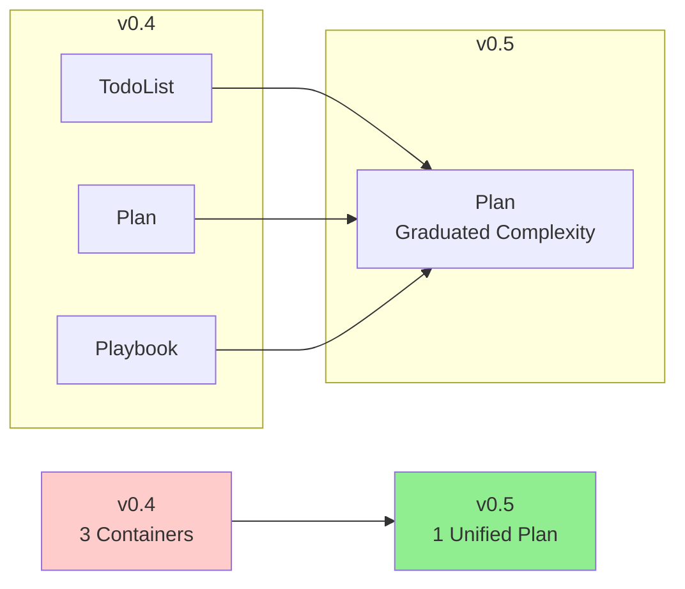

# vBRIEF v0.5-beta Release Notes

**Release Date**: 2026-02-03  
**Status**: Beta Release  
**Breaking Changes**: Yes (see Migration Guide)

## 🎉 Major Changes

vBRIEF v0.5 represents a **fundamental architectural refactor** that unifies todos, plans, playbooks, and prompt-graphs into a single, powerful Plan model.

### The Big Picture



## ✨ What's New

### 1. Unified Plan Model

**Before (v0.4)**: Three separate containers
- TodoList for tasks
- Plan for projects
- Playbook for retrospectives

**After (v0.5)**: One Plan container with graduated complexity
- Minimal Plan = todo list
- Structured Plan = project plan
- Retrospective Plan = playbook
- DAG Plan = workflow orchestration

### 2. DAG Support

Plans now support **Directed Acyclic Graphs** for complex workflows:

```json
{
  "edges": [
    {"from": "lint", "to": "build", "type": "blocks"},
    {"from": "test", "to": "build", "type": "blocks"},
    {"from": "build", "to": "deploy", "type": "blocks"}
  ]
}
```

**Edge Types:**
- `blocks` - Hard dependency (must wait)
- `informs` - Soft dependency (provides context)
- `invalidates` - Conditional execution
- `suggests` - Optional recommendation

### 3. Hierarchical IDs

Items support dot notation for nested organization:

```json
{
  "items": [
    {
      "id": "backend.auth.jwt",
      "title": "JWT Implementation",
      "status": "running"
    }
  ]
}
```

### 4. Token Efficiency

TRON format achieves **35-40% token reduction** vs JSON:

**JSON**: 267 tokens  
**TRON**: 162 tokens (39% savings)

See [TRON Encoding Guide](docs/tron-encoding.md)

### 5. Enhanced Validation

Comprehensive validation with three layers:
1. JSON Schema validation
2. 10 conformance criteria
3. DAG validation (cycle detection, reference validation)

```bash
python3 validation/vbrief_validator.py plan.vbrief.json
```

### 6. Visual Documentation

Beautiful Mermaid diagrams throughout documentation:
- Status lifecycle
- Graduated complexity model
- DAG semantics
- Best practices

### 7. DAG Visualizer Tool

Generate visual diagrams from Plans:

```bash
# Markdown with Mermaid
python3 tools/dag-visualizer.py plan.vbrief.json > diagram.md

# Interactive HTML
python3 tools/dag-visualizer.py plan.vbrief.json --format html > diagram.html
```

## 💔 Breaking Changes

### Removed Features

- ❌ **TodoList container** - Use Plan with minimal fields
- ❌ **Playbook container** - Use Plan with retrospective narratives
- ❌ **dependencies field** - Use edges with type="blocks"
- ❌ **PlanItem.todoList** - Use subItems or planRef

### Changed Features

- 🔄 **Status enum**: `inProgress` → `running`
- 🔄 **Plan.narratives**: Now optional (was required)
- 🔄 **PlanItem**: Merged TodoItem fields

### Migration Required

All v0.4 documents require migration. See [MIGRATION.md](MIGRATION.md) for detailed instructions.

## 📦 What's Included

### Schema
- `schemas/vbrief-core.schema.json` - Unified JSON Schema

### Examples
- `examples/minimal-plan.vbrief.json` - Todo-like usage
- `examples/structured-plan.vbrief.json` - With narratives
- `examples/retrospective-plan.vbrief.json` - Playbook-style
- `examples/dag-plan.vbrief.json` - With DAG edges
- `examples/dag-plan.vbrief.tron` - TRON format

### Validation Tools
- `validation/dag_validator.py` - DAG cycle detection
- `validation/vbrief_validator.py` - Comprehensive validation

### Visualization
- `tools/dag-visualizer.py` - Mermaid diagram generator

### Documentation
- `SPECIFICATION.md` - Complete technical spec
- `GUIDE.md` - User guide with diagrams
- `MIGRATION.md` - v0.4 → v0.5 migration guide
- `docs/tron-encoding.md` - TRON format guide

## 🚀 Getting Started

### 1. Create a Minimal Plan

```json
{
  "vBRIEFInfo": {"version": "0.5"},
  "plan": {
    "title": "My Tasks",
    "status": "running",
    "items": [
      {"title": "Task 1", "status": "pending"},
      {"title": "Task 2", "status": "running"}
    ]
  }
}
```

### 2. Validate It

```bash
python3 validation/vbrief_validator.py my-plan.vbrief.json
```

### 3. Add Complexity as Needed

```json
{
  "plan": {
    "title": "My Tasks",
    "status": "running",
    "narratives": {
      "Proposal": "Complete Q1 objectives"
    },
    "items": [...],
    "edges": [
      {"from": "task1", "to": "task2", "type": "blocks"}
    ],
    "tags": ["q1", "priority"]
  }
}
```

## 📚 Documentation

- **[GUIDE.md](GUIDE.md)** - Start here! User-friendly guide with examples
- **[SPECIFICATION.md](SPECIFICATION.md)** - Technical specification
- **[MIGRATION.md](MIGRATION.md)** - v0.4 → v0.5 migration
- **[docs/tron-encoding.md](docs/tron-encoding.md)** - Token efficiency

## 🔧 Tools

### Validation
```bash
# Comprehensive validation
python3 validation/vbrief_validator.py plan.vbrief.json

# DAG validation only
python3 validation/dag_validator.py plan.vbrief.json
```

### Visualization
```bash
# Generate Markdown diagram
python3 tools/dag-visualizer.py plan.vbrief.json > diagram.md

# Generate interactive HTML
python3 tools/dag-visualizer.py plan.vbrief.json -f html > diagram.html

# Left-to-right layout
python3 tools/dag-visualizer.py plan.vbrief.json -d LR
```

## ⚠️ Known Limitations

### Beta Status

This is a **beta release**. While the core specification is stable, some features are still evolving:

- ✅ Core schema - Stable
- ✅ Validation - Stable
- ✅ Examples - Stable
- ✅ Documentation - Stable
- ⏳ API implementations - Coming soon
- ⏳ TRON parsers - Coming soon

### Not Yet Implemented

- **API Libraries**: Go, Python, TypeScript APIs (Phase 5)
- **TRON Parsers**: Native TRON parsing (using JSON for now)
- **TUI Explorer**: Interactive Plan explorer (Phase 6.2)
- **Package Publishing**: npm, PyPI, Go module (Phase 7)

### Workarounds

**No TRON parser?** Use JSON format. TRON support coming in future releases.

**No API library?** Use JSON Schema validation directly with jsonschema library.

## 🐛 Bug Reports

Found an issue? Please report:
- GitHub Issues: https://github.com/visionik/vBRIEF/issues
- Include: vBRIEF version, example document, error message

## 🤝 Contributing

Contributions welcome! Areas needing help:
- API implementations (Go, Python, TypeScript)
- TRON parser libraries
- Additional examples
- Documentation improvements

## 📊 Statistics

- **Lines of Code**: ~3,300+
- **Schema Files**: 1 unified schema
- **Example Documents**: 6
- **Validation Tools**: 3
- **Documentation Pages**: 4 major docs
- **Mermaid Diagrams**: 10+
- **Test Coverage**: All examples validate

## 🎯 Design Goals (Achieved)

✅ **Unified Model** - Single Plan container for all use cases  
✅ **Graduated Complexity** - Start simple, add features as needed  
✅ **Token Efficiency** - 35-40% reduction with TRON  
✅ **DAG Support** - Complex workflows with cycle detection  
✅ **Interoperability** - JSON Schema validation  
✅ **Visual Documentation** - Mermaid diagrams throughout  

## 🔮 What's Next

### v0.5 Stable (Target: Q1 2026)
- API implementations (Go, Python, TypeScript)
- TRON parser libraries
- Package publishing
- Community feedback integration

### v0.6 (Future)
- Data flow edges (prompt-graph support)
- Additional edge types
- Performance optimizations
- Enhanced visualization

## 📝 Upgrade Path

1. Read [MIGRATION.md](MIGRATION.md)
2. Update documents to v0.5 format
3. Validate with `vbrief_validator.py`
4. Test with your workflows
5. Report any issues

## 🙏 Acknowledgments

This release represents a complete rethinking of how agentic systems manage memory. Thanks to the community for feedback and the vision for a unified, interoperable format.

## 📄 License

See LICENSE file for details.

## 📞 Support

- Documentation: See docs/ directory
- Examples: See examples/ directory
- Issues: https://github.com/visionik/vBRIEF/issues
- Discussions: https://github.com/visionik/vBRIEF/discussions

---

**Ready to try vBRIEF v0.5-beta?**

Start with [GUIDE.md](GUIDE.md) and create your first unified Plan!
